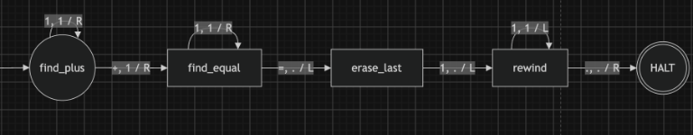
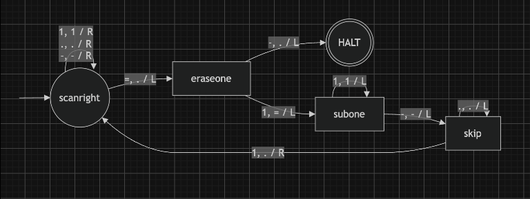
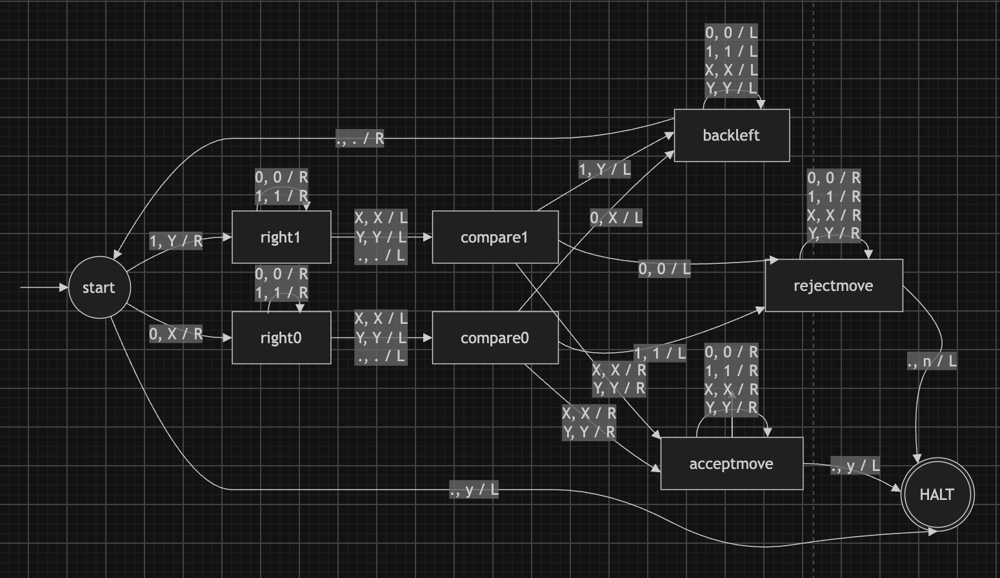
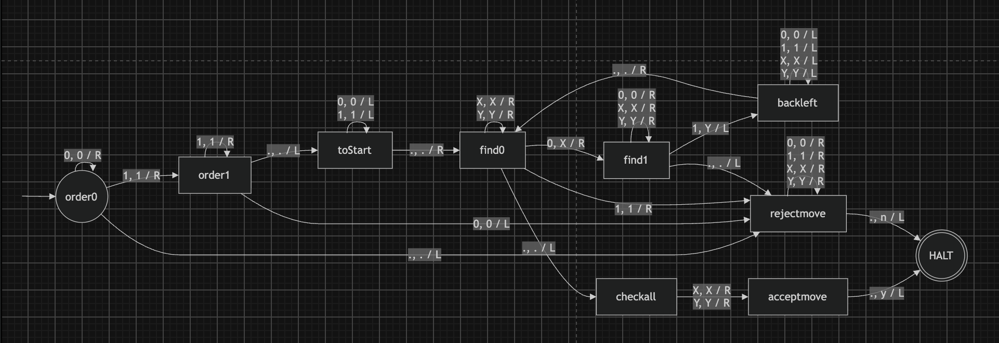
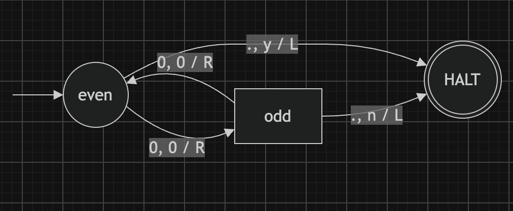

# ft_turing

A fully functional Turing Machine simulator written in OCaml, featuring a custom Python generator for a Universal Turing Machine (UTM). This project demonstrates the theoretical foundations of computation, state machines, and the Fetch-Decode-Execute cycle.

## 🚀 Features

*   **Turing Machine Simulator:** Written purely in OCaml, it reads a machine description (in JSON format) and an input string, and simulates the machine's execution step-by-step.
*   **Tape Visualization:** Features a dynamic, fixed-width sliding window visualization of the infinite tape, keeping the read/write head perfectly centered during execution.
*   **Universal Turing Machine (UTM):** Includes a Python compiler/generator (`gen_universal.py`) that translates any given Turing Machine into a set of rules encoded directly on a tape.
*   **Robust Parsing & Validation:** Complete error handling against infinite loops, missing transitions (Machine BLOCKED), and invalid JSON formatting.

## 📂 Project Structure

```text
.
├── Makefile                
├── src/                    
│   ├── cli.ml, errors.ml, json.ml, machine_loop.ml, main.ml
│   ├── parse.ml, tape.ml, types.ml, utils.ml, validate.ml
└── machines/               
    ├── gen_universal.py
    ├── palindrome.json, unary_add.json, unary_sub.json
    ├── universal.json, zero_n_one_n.json, zero_pow_2n.json

```

## 🛠️ Compilation

To compile the project, simply run the following command at the root of the repository.

```bash
make
```

---

## 💻 Usage & Machines

Run the simulator by providing the path to a machine's JSON file and an initial input string.

### 1. Unary Addition (`unary_add.json`)


Adds two unary numbers separated by a `+`.

```bash
./ft_turing machines/unary_add.json "111+11="
```

### 2. Unary Subtraction (`unary_sub.json`)


Subtracts the right unary number from the left unary number.

```bash
./ft_turing machines/unary_sub.json "111-11="
```

### 3. Palindrome Checker (`palindrome.json`)


Checks if a given binary string is a palindrome.

```bash
./ft_turing machines/palindrome.json "111100001111"
```

### 4. Language Rejection 0^n1^n (`zero_n_one_n.json`)


Tests a string against the 0^n1^n rule.

```bash
./ft_turing machines/zero_n_one_n.json "111000"
```

### 5. Parity/Sequence Checker (`zero_pow_2n.json`)


Checks parity rules based on specific state toggling.

```bash
./ft_turing machines/zero_pow_2n.json "000000"
```

---

## 🧠 The Universal Turing Machine (UTM)

The pinnacle of this project is the Universal Turing Machine. Instead of hardcoding states into a machine, the UTM reads its operating instructions directly from the tape!

**Step 1:** Generate the UTM hardware (JSON) and the encoded tape data using the Python builder.

```bash
python3 machines/gen_universal.py
```

**Step 2:** Run the generated tape in the Universal Machine. *(Note: Always wrap the tape string in single quotes `''` to prevent shell variable expansion of the `$` character).*

```bash
./ft_turing machines/universal.json '#a:1:a:1:R;a:+:b:1:R;b:1:b:1:R;b:=:c:.:L;c:1:d:.:L;d:1:d:1:L;d:.:e:.:R;$.~.~.A1~1~+~1~=~.~.~.~.~.~.~#'
```